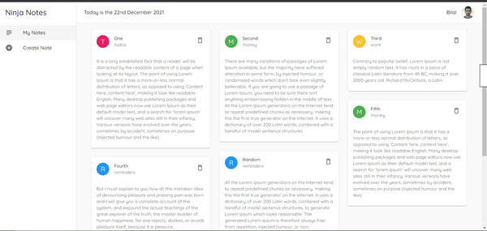
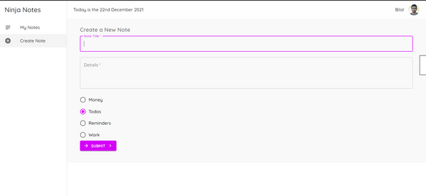

### Starter Project for the Material UI playlist

I have created this notes app using React JS and I have used Material-UI for styling purposes.

Download the code & run **npm install** to install dependencies before starting the app.

